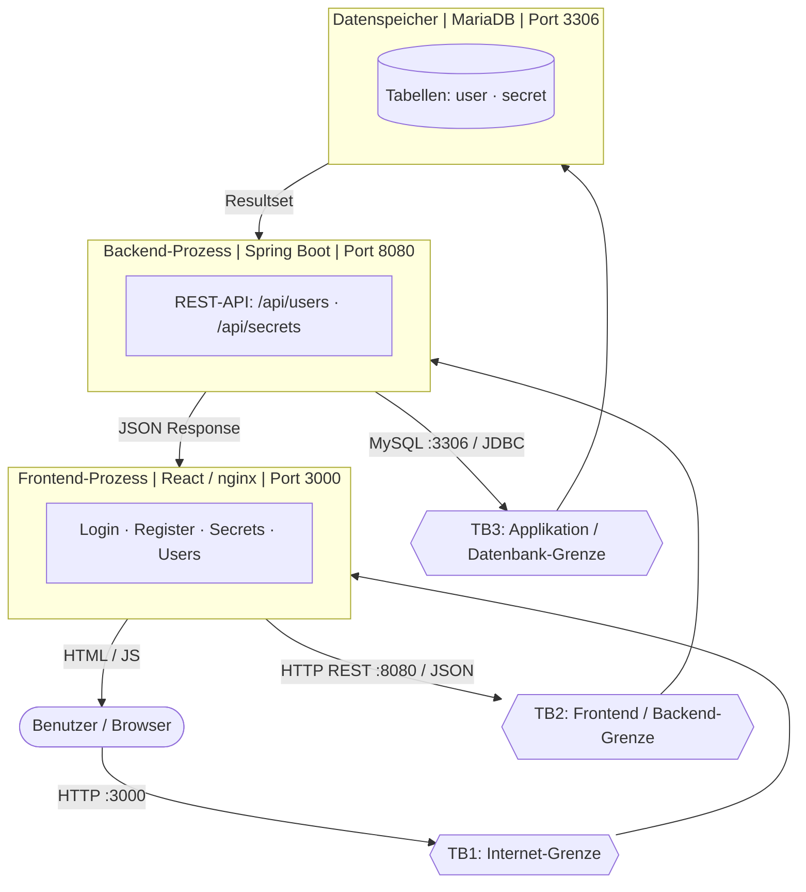

# Threat-Analyse: Tresor Password Manager

## 1. Systemübersicht

**Tresor** ist eine webbasierte Passwort-Manager-Applikation, die Benutzern ermöglicht, verschlüsselte Secrets (Zugangsdaten, Kreditkarten, Notizen) zu speichern. Die Applikation besteht aus drei Schichten, die via Docker Compose betrieben werden:

| Komponente | Technologie | Port |
|---|---|---|
| Frontend | React.js / nginx | 3000 |
| Backend | Spring Boot (Java) | 8080 |
| Datenbank | MariaDB | 3306 |

---

## 2. Data Flow Diagram



### 2.1 Trust Boundaries

| ID | Bezeichnung | Zwischen | Protokoll |
|---|---|---|---|
| **TB1** | Internet-/Systemgrenze | Benutzer (Browser) ↔ Frontend | HTTP |
| **TB2** | Frontend/Backend-Grenze | Frontend ↔ Backend REST-API | HTTP (unverschlüsselt) |
| **TB3** | Applikations-/Datenbankgrenze | Backend ↔ MariaDB | MySQL/JDBC |

---

## 3. STRIDE-Analyse

### TB1 — Benutzer ↔ Frontend

| ID | Kategorie | Bedrohung |
|---|---|---|
| T-01 | **Spoofing** | Nach dem Login wird nur die `userId` client-seitig gespeichert (kein echter Session-Token). Ein Angreifer kann eine fremde `userId` in Requests einsetzen und sich so als anderer Benutzer ausgeben. |
| T-02 | **Tampering** | Die Secret-Content-Felder werden ohne Output-Encoding gerendert. Ein Angreifer kann persistentes XSS einschleusen, das bei jedem Seitenaufruf anderer Benutzer ausgeführt wird. |
| T-03 | **Repudiation** | Es existiert kein client-seitiges Audit-Log. Benutzeraktionen (Secret anlegen, löschen) sind weder im Frontend noch im Backend protokolliert und damit nicht nachvollziehbar. |
| T-04 | **Information Disclosure** | Sensitive Daten (userId, API-Antworten) werden via `console.log` in die Browserkonsole geschrieben (FetchUser.js, FetchSecrets.js). Auf einem gemeinsam genutzten Gerät sind diese auslesbar. |
| T-05 | **Denial of Service** | Die Registrierungs- und Login-Formulare haben kein Rate-Limiting. Ein Angreifer kann massenhaft Requests absenden und die Datenbank bzw. den Backend-Prozess überlasten. |
| T-06 | **Elevation of Privilege** | Da die `userId` client-seitig kontrolliert wird und keine serverseitige Session-Validierung stattfindet, kann ein Benutzer durch Manipulation der `userId` auf Secrets anderer Benutzer zugreifen. |

### TB2 — Frontend ↔ Backend REST-API (HTTP)

| ID | Kategorie | Bedrohung |
|---|---|---|
| T-07 | **Spoofing** | Kein API-Authentifizierungsmechanismus (kein JWT, kein Bearer-Token). Jeder, der die API-URL kennt, kann direkt alle Endpunkte ohne Credentials aufrufen. |
| T-08 | **Spoofing** | Der Login-Endpoint `POST /api/users/login` prüft das Passwort nicht (expliziter TODO-Kommentar im Code). Ein Login mit beliebigem Passwort ist erfolgreich. |
| T-09 | **Tampering** | Die gesamte Kommunikation läuft über unverschlüsseltes HTTP. Ein MITM-Angreifer im Netzwerk kann Requests und Responses beliebig modifizieren. |
| T-10 | **Tampering** | Kein CSRF-Schutz auf state-ändernden Endpunkten (POST/PUT/DELETE). Präparierte externe Seiten können im Namen eines eingeloggten Benutzers Requests auslösen. |
| T-11 | **Repudiation** | Keine serverseitige Protokollierung von API-Zugriffen. Wer wann welche Secrets abgerufen oder manipuliert hat, ist nicht nachvollziehbar. |
| T-12 | **Information Disclosure** | `GET /api/users` gibt alle Benutzerdatensätze inklusive Passwort-Feld ohne jede Authentifizierung zurück. |
| T-13 | **Information Disclosure** | `GET /api/secrets` gibt alle Secrets aller Benutzer ohne Authentifizierung zurück. |
| T-14 | **Information Disclosure** | Secrets (Passwörter, Kreditkartendaten) werden über unverschlüsseltes HTTP übertragen und sind damit für Netzwerkbeobachter lesbar. |
| T-15 | **Information Disclosure** | Unkontrollierte Fehlermeldungen und interne Stack-Traces können dem Angreifer Informationen über die Systemarchitektur, Frameworks und Datenbankstruktur liefern. |
| T-16 | **Denial of Service** | Kein Rate-Limiting auf `POST /api/users/login`. Ermöglicht unbegrenzte Brute-Force-Angriffe auf Benutzerpasswörter. |
| T-17 | **Denial of Service** | Kein Rate-Limiting auf `POST /api/users`. Massenregistrierung kann die Datenbank mit Spam-Accounts fluten. |
| T-18 | **Elevation of Privilege** | IDOR (Insecure Direct Object Reference): `POST /api/secrets/byuserid` akzeptiert eine beliebige `userId` und gibt die zugehörigen Secrets zurück — ohne zu prüfen, ob der Anfrager der Eigentümer ist. |
| T-19 | **Elevation of Privilege** | `DELETE /api/secrets/{id}` löscht ein Secret ohne jede Authentifizierung oder Eigentümerprüfung. Der Code-Kommentar bezeichnet dies explizit als „brute force delete". |
| T-20 | **Elevation of Privilege** | `PUT /api/users/{id}` erlaubt das Überschreiben beliebiger Benutzerdaten (inkl. E-Mail, Passwort) ohne Authentifizierung. |
| T-21 | **Elevation of Privilege** | `DELETE /api/users/{id}` löscht beliebige Benutzer ohne Authentifizierung. |

### TB3 — Backend ↔ MariaDB

| ID | Kategorie | Bedrohung |
|---|---|---|
| T-22 | **Spoofing** | Docker Compose verwendet den `root`-Datenbankbenutzer mit dem hartcodierten Passwort `1234`. Jeder mit Zugriff auf das Repository kennt die DB-Credentials. |
| T-23 | **Spoofing** | Die Datenbankverbindung ist nicht TLS-verschlüsselt. Ein Angreifer im internen Netz kann die MySQL-Kommunikation mitlesen und Credentials extrahieren. |
| T-24 | **Tampering** | `EncryptUtil` ist ein nicht implementierter Stub — `encrypt()` und `decrypt()` geben die Eingabe unverändert zurück. Secrets werden unverschlüsselt als Klartext-JSON in der Datenbank gespeichert. |
| T-25 | **Tampering** | `PasswordEncryptService.hashPassword()` ist ein Stub — gibt das Passwort im Klartext zurück. Passwörter werden ungehasht in der Datenbank gespeichert. |
| T-26 | **Tampering** | Die SQL-Seed-Datei `tresordb.sql` enthält Klartextpasswörter und vollständige Kreditkartendaten (Kartennummer, CVV, Ablaufdatum) als Beispieldaten im Repository. |
| T-27 | **Repudiation** | Kein Datenbank-Audit-Log. Direkte Datenbankzugriffe (z.B. durch einen kompromittierten Root-Account) sind nicht nachvollziehbar. |
| T-28 | **Information Disclosure** | Bei einer Kompromittierung der Datenbank liegen sämtliche Passwörter und Secrets im Klartext vor — kein Hashing, keine Verschlüsselung schützt die Daten. |
| T-29 | **Information Disclosure** | Kreditkartendaten (Kartennummer, CVV, Ablaufdatum) werden als unverschlüsseltes JSON-Feld gespeichert und sind bei jedem Datenbankzugriff direkt lesbar. |
| T-30 | **Denial of Service** | Kein konfiguriertes Connection-Pool-Limit. Ein Angreifer kann durch viele parallele Requests alle Datenbankverbindungen erschöpfen und die Applikation lahmlegen. |
| T-31 | **Elevation of Privilege** | Der `root`-Datenbankbenutzer besitzt vollständige DDL-Rechte (DROP, ALTER, CREATE). Ein kompromittierter Backend-Prozess kann die gesamte Datenbankstruktur zerstören. |
| T-32 | **Elevation of Privilege** | Potenzielle SQL-Injection durch nicht validierte Eingaben. JPA/Hibernate reduziert das Risiko für Standard-Queries, schließt es aber nicht vollständig aus — besonders bei nativen Queries. |

---

## 4. DREAD-Tabelle

**Skala:** 1 (minimal) – 10 (maximal)  
**Score:** Durchschnitt aller fünf Dimensionen  
**D** = Damage, **R** = Reproducibility, **E** = Exploitability, **A** = Affected Users, **Disc** = Discoverability

| ID | Bedrohung (Kurzform) | D | R | E | A | Disc | **Score** |
|---|---|---|---|---|---|---|---|
| T-01 | Spoofing via userId (kein Session-Token) | 7 | 8 | 7 | 8 | 6 | **7.2** |
| T-02 | XSS via Secret-Content | 7 | 6 | 6 | 8 | 6 | **6.6** |
| T-03 | Kein Audit-Log (Frontend) | 4 | 10 | 10 | 10 | 8 | **8.4** |
| T-04 | console.log mit Userdaten | 6 | 8 | 8 | 7 | 7 | **7.2** |
| T-05 | Kein Rate-Limiting (Formulare) | 5 | 9 | 9 | 9 | 7 | **7.8** |
| T-06 | Client-seitige userId-Manipulation | 8 | 9 | 8 | 9 | 7 | **8.2** |
| T-07 | Keine API-Authentifizierung | 9 | 10 | 10 | 10 | 9 | **9.6** |
| T-08 | Login prüft Passwort nicht | 9 | 10 | 10 | 10 | 8 | **9.4** |
| T-09 | HTTP MITM (kein TLS) | 8 | 5 | 5 | 10 | 5 | **6.6** |
| T-10 | Kein CSRF-Schutz | 7 | 7 | 7 | 8 | 6 | **7.0** |
| T-11 | Kein Audit-Log (Backend) | 5 | 10 | 10 | 10 | 7 | **8.4** |
| T-12 | GET /api/users ohne Auth | 9 | 10 | 10 | 10 | 9 | **9.6** |
| T-13 | GET /api/secrets ohne Auth | 10 | 10 | 10 | 10 | 9 | **9.8** |
| T-14 | Secrets über HTTP übertragen | 8 | 8 | 6 | 10 | 6 | **7.6** |
| T-15 | Stack-Traces in Fehlermeldungen | 4 | 7 | 7 | 5 | 7 | **6.0** |
| T-16 | Brute Force Login (kein Rate-Limit) | 8 | 9 | 8 | 10 | 8 | **8.6** |
| T-17 | Massenregistrierung (kein Rate-Limit) | 6 | 9 | 9 | 9 | 7 | **8.0** |
| T-18 | IDOR: Secrets via userId | 9 | 10 | 9 | 10 | 8 | **9.2** |
| T-19 | DELETE Secret ohne Auth | 8 | 10 | 10 | 10 | 8 | **9.2** |
| T-20 | PUT User ohne Auth | 9 | 10 | 10 | 10 | 8 | **9.4** |
| T-21 | DELETE User ohne Auth | 9 | 10 | 10 | 10 | 8 | **9.4** |
| T-22 | Hardcoded Root-DB-Credentials | 10 | 10 | 8 | 10 | 7 | **9.0** |
| T-23 | DB-Verbindung ohne TLS | 8 | 6 | 5 | 10 | 5 | **6.8** |
| T-24 | Secrets unverschlüsselt (Stub) | 10 | 10 | 9 | 10 | 8 | **9.4** |
| T-25 | Passwörter im Klartext (Stub) | 10 | 10 | 9 | 10 | 8 | **9.4** |
| T-26 | Klartextdaten in tresordb.sql | 8 | 10 | 9 | 3 | 8 | **7.6** |
| T-27 | Kein DB-Audit-Log | 5 | 10 | 10 | 10 | 7 | **8.4** |
| T-28 | Alle Daten im Klartext bei DB-Kompromittierung | 10 | 7 | 6 | 10 | 5 | **7.6** |
| T-29 | Kreditkartendaten unverschlüsselt | 10 | 10 | 9 | 10 | 8 | **9.4** |
| T-30 | Kein Connection-Pool-Limit | 7 | 7 | 8 | 10 | 5 | **7.4** |
| T-31 | Root-DB-User hat DDL-Rechte | 10 | 8 | 7 | 10 | 6 | **8.2** |
| T-32 | SQL-Injection (partial) | 9 | 5 | 5 | 10 | 6 | **7.0** |

### 4.1 Ranking nach DREAD-Score

| Rang | ID | Score | Kategorie |
|---|---|---|---|
| 1 | T-13 | 9.8 | Information Disclosure |
| 2 | T-07 | 9.6 | Spoofing |
| 3 | T-12 | 9.6 | Information Disclosure |
| 4 | T-08 | 9.4 | Spoofing |
| 5 | T-20 | 9.4 | Elevation of Privilege |
| 6 | T-21 | 9.4 | Elevation of Privilege |
| 7 | T-24 | 9.4 | Tampering |
| 8 | T-25 | 9.4 | Tampering |
| 9 | T-29 | 9.4 | Information Disclosure |
| 10 | T-18 | 9.2 | Elevation of Privilege |
| 11 | T-19 | 9.2 | Elevation of Privilege |
| 12 | T-22 | 9.0 | Spoofing |
| 13 | T-16 | 8.6 | Denial of Service |
| 14 | T-03 | 8.4 | Repudiation |
| 15 | T-11 | 8.4 | Repudiation |
| 16 | T-27 | 8.4 | Repudiation |
| 17 | T-31 | 8.2 | Elevation of Privilege |
| 18 | T-06 | 8.2 | Elevation of Privilege |
| 19 | T-17 | 8.0 | Denial of Service |
| 20 | T-05 | 7.8 | Denial of Service |

---

## 5. Diskussion: DREAD und Risiko

### 5.1 Verbindung zwischen DREAD-Score und Risiko (Impact × Likelihood)

Das klassische Risikomodell berechnet: **Risiko = Impact × Likelihood**

DREAD bildet dieses Modell ab, indem es die fünf Dimensionen auf die zwei Risikofaktoren verteilt:

| Risikofaktor | DREAD-Dimensionen |
|---|---|
| **Impact** | Damage (D) + Affected Users (A) |
| **Likelihood** | Reproducibility (R) + Exploitability (E) + Discoverability (Disc) |

Für jede Bedrohung lassen sich damit zwei Teilwerte berechnen:

$$\text{Impact} = \frac{D + A}{2} \qquad \text{Likelihood} = \frac{R + E + \text{Disc}}{3}$$

$$\text{Risiko} = \text{Impact} \times \text{Likelihood}$$

Der DREAD-Durchschnittsscore approximiert dieses Produkt, gewichtet jedoch alle Dimensionen gleichmässig. Die folgende Tabelle zeigt exemplarisch die Top-5 nach explizitem Risikoprodukt:

| ID | Impact | Likelihood | Risiko (I×L) | DREAD-Score |
|---|---|---|---|---|
| T-13 | 10.0 | 9.67 | **96.7** | 9.8 |
| T-07 | 9.5 | 9.67 | **91.9** | 9.6 |
| T-12 | 9.5 | 9.67 | **91.9** | 9.6 |
| T-08 | 9.5 | 9.33 | **88.6** | 9.4 |
| T-25 | 10.0 | 9.0 | **90.0** | 9.4 |

**Beobachtungen:**

- Bedrohungen mit hohem Impact **und** hoher Likelihood (T-13, T-07) dominieren beide Modelle konsistent — sie sind die kritischsten Risiken.
- Bedrohungen wie T-09 (HTTP MITM, Score 6.6) haben einen hohen Impact (8), aber niedrige Likelihood (Reproducibility 5, Exploitability 5) — im Risikoprodukt sinkt ihre Priorität, was realistischer ist: MITM erfordert Netzwerkzugang.
- Reine Repudiation-Bedrohungen (T-03, T-11, T-27, Score ~8.4) haben hohe Likelihood (immer gegeben, da das Feature schlicht fehlt), aber begrenzten direkten Schaden — sie sind wichtig für Compliance, aber weniger dringlich als Access-Control-Lücken.
- Der DREAD-Score tendiert dazu, "trivial ausnutzbare aber niedrig-impakt"-Bedrohungen überzubewerten. Das explizite Risikoprodukt korrigiert dies und eignet sich besser für Priorisierungsentscheidungen.

---

## 6. Top-10 Mitigations

### Rang 1 — T-13: GET /api/secrets ohne Authentifizierung

**Mitigation:** Spring Security mit `@PreAuthorize("isAuthenticated()")` auf dem Endpunkt einrichten. Secrets dürfen ausschliesslich für die eigene, per Session/JWT verifizierte `userId` abgerufen werden.

**OWASP-Bezug:** [A01:2021 Broken Access Control](https://owasp.org/Top10/A01_2021-Broken_Access_Control/) — Das Fehlen jeder Zugangskontrolle auf einem sensitiven Endpunkt ist das Paradebeispiel für diese Kategorie. OWASP listet "Zugriff auf APIs ohne Zugriffskontrollen für POST, PUT und DELETE" explizit als Beispielfall auf.

---

### Rang 2 — T-07: Keine API-Authentifizierung

**Mitigation:** Einführung von JWT-basierter Authentifizierung. Nach erfolgreichem Login gibt der Server ein signiertes JWT zurück. Alle geschützten Endpunkte validieren dieses Token über einen Spring Security `JwtAuthenticationFilter`. Jeder Request ohne gültiges Token wird mit HTTP 401 abgelehnt.

**OWASP-Bezug:** [A07:2021 Identification and Authentication Failures](https://owasp.org/Top10/A07_2021-Identification_and_Authentication_Failures/) — Das vollständige Fehlen von Authentifizierung ist die schwerwiegendste Form dieser Kategorie.

---

### Rang 3 — T-12: GET /api/users ohne Authentifizierung

**Mitigation:** Endpunkt hinter Authentifizierung legen und auf Admin-Rolle beschränken (`@PreAuthorize("hasRole('ADMIN')")`). Für normale Benutzer sollte maximal das eigene Benutzerprofil abrufbar sein. Das Passwort-Feld darf in keinem Fall in der API-Response erscheinen (`@JsonIgnore` auf `User.password`).

**OWASP-Bezug:** [A01:2021 Broken Access Control](https://owasp.org/Top10/A01_2021-Broken_Access_Control/) — Massenexposition sensibler Daten durch fehlende Zugangskontrolle und ungefiltertes Data Exposure.

---

### Rang 4 — T-08: Login prüft Passwort nicht

**Mitigation:** Implementierung der Passwortprüfung in `UserController.doLoginUser()`: Das eingegebene Passwort mit `BCrypt.checkpw(loginUser.getPassword(), user.getPassword())` gegen den gespeicherten Hash prüfen. Nur bei Übereinstimmung wird ein JWT ausgestellt.

**OWASP-Bezug:** [A07:2021 Identification and Authentication Failures](https://owasp.org/Top10/A07_2021-Identification_and_Authentication_Failures/) — Ein Login-Endpoint, der das Passwort nicht verifiziert, macht jede Authentifizierung wirkungslos.

---

### Rang 5 — T-24: Secrets werden unverschlüsselt gespeichert (EncryptUtil Stub)

**Mitigation:** `EncryptUtil` vollständig mit AES-256 über die Jasypt-Bibliothek implementieren (die Dependency ist bereits im `pom.xml` vorhanden). Der Encryption-Key wird pro Benutzer aus dem Login-Passwort und einem Salt abgeleitet (PBKDF2), sodass nur der jeweilige Benutzer seine eigenen Secrets entschlüsseln kann.

**OWASP-Bezug:** [A02:2021 Cryptographic Failures](https://owasp.org/Top10/A02_2021-Cryptographic_Failures/) — Sensitive Daten ohne Verschlüsselung zu speichern ist die Kerndefinition dieser Kategorie ("Failure to... encrypt sensitive data at rest").

---

### Rang 6 — T-25: Passwörter werden im Klartext gespeichert (PasswordEncryptService Stub)

**Mitigation:** `PasswordEncryptService.hashPassword()` mit BCrypt implementieren: `BCryptPasswordEncoder encoder = new BCryptPasswordEncoder(12); return encoder.encode(password);`. Bestehende Klartextpasswörter in der Datenbank müssen migriert werden. Der Work-Factor 12 bietet ausreichenden Schutz gegen Brute-Force-Angriffe.

**OWASP-Bezug:** [A02:2021 Cryptographic Failures](https://owasp.org/Top10/A02_2021-Cryptographic_Failures/) — Klartext-Passwörter sind eine der häufigsten und folgenschwersten kryptographischen Schwachstellen; OWASP nennt "password hashing" explizit als geforderte Mindestmassnahme.

---

### Rang 7 — T-20 / T-21: PUT/DELETE User ohne Authentifizierung

**Mitigation:** Beide Endpunkte hinter JWT-Authentifizierung legen. Zusätzlich serverseitig prüfen, dass der authentifizierte Benutzer nur seinen eigenen Account modifizieren oder löschen kann (`if (!currentUser.getId().equals(userId)) return ResponseEntity.status(403).build()`). Admin-Operationen erfordern eine explizite Admin-Rolle.

**OWASP-Bezug:** [A01:2021 Broken Access Control](https://owasp.org/Top10/A01_2021-Broken_Access_Control/) — Ungeschützte Mutationsendpunkte auf Benutzerressourcen sind ein klassisches Beispiel für fehlende Autorisierungsprüfungen.

---

### Rang 8 — T-29: Kreditkartendaten unverschlüsselt gespeichert

**Mitigation:** Durch die Implementierung von T-24 (EncryptUtil) werden alle Secrets — inklusive Kreditkartendaten — verschlüsselt gespeichert. Zusätzlich sollte für Kreditkartendaten PCI-DSS-Compliance geprüft werden: CVV-Werte dürfen nach Autorisierung nie persistent gespeichert werden. Als zusätzliche Schicht kann eine feldbasierte Verschlüsselung für besonders sensitive Felder erwogen werden.

**OWASP-Bezug:** [A02:2021 Cryptographic Failures](https://owasp.org/Top10/A02_2021-Cryptographic_Failures/) — Kreditkartendaten sind regulatorisch (PCI-DSS) als besonders sensitive Daten eingestuft; unverschlüsselte Speicherung ist ein direkter Verstoss.

---

### Rang 9 — T-18: IDOR — Secrets anderer Benutzer abrufbar

**Mitigation:** In `SecretController.getSecretsByUserId()` prüfen, ob die angeforderte `userId` mit der ID des authentifizierten Benutzers übereinstimmt. Der Vergleich muss serverseitig aus dem validierten JWT-Token erfolgen — nie aus dem Request-Body, den der Client kontrolliert.

```java
Long authenticatedUserId = jwtService.extractUserId(token);
if (!authenticatedUserId.equals(credentials.getUserId())) {
    return ResponseEntity.status(403).build();
}
```

**OWASP-Bezug:** [A01:2021 Broken Access Control](https://owasp.org/Top10/A01_2021-Broken_Access_Control/) — IDOR ist einer der explizit genannten Angriffsvektoren unter A01; OWASP beschreibt "using a primary key" als Referenz auf fremde Datensätze als typisches Beispiel.

---

### Rang 10 — T-16: Brute-Force-Login durch fehlendes Rate-Limiting

**Mitigation:** Rate-Limiting auf `POST /api/users/login` mit Bucket4j oder Spring's `@RateLimiter` einrichten (z.B. max. 5 Versuche pro IP in 15 Minuten). Nach Überschreitung: temporäres Account-Lockout oder CAPTCHA-Challenge. Fehlgeschlagene Logins in einem Audit-Log protokollieren und Alerts bei ungewöhnlichen Mustern auslösen.

**OWASP-Bezug:** [A04:2021 Insecure Design](https://owasp.org/Top10/A04_2021-Insecure_Design/) — Das Fehlen von Rate-Limiting und Account-Lockout ist ein Designmangel, der Brute-Force-Angriffe erst ermöglicht. OWASP A04 fordert explizit "limit resource consumption by user or service" als Designprinzip.

---

## 7. Zusammenfassung

Das Tresor-Projekt weist in seinem aktuellen Zustand **kritische Sicherheitslücken** auf, die primär aus nicht implementierten Stubs (Verschlüsselung, Passwort-Hashing, Login-Verifikation) und fehlenden Zugriffskontrollen resultieren. Die fünf dringlichsten Massnahmen nach DREAD-Priorisierung sind:

1. **Authentifizierung** auf allen API-Endpunkten (JWT)
2. **Login-Passwortprüfung** implementieren
3. **BCrypt-Hashing** für Passwörter
4. **AES-256-Verschlüsselung** für Secrets
5. **Autorisierungsprüfungen** (Eigentümer-Check) auf allen Datenzugriffen

Ohne diese Massnahmen ist die Applikation nicht produktionstauglich — ein unauthentifizierter Angreifer kann mit einem einzigen HTTP-Request alle Secrets und Passwörter aller Benutzer auslesen.
